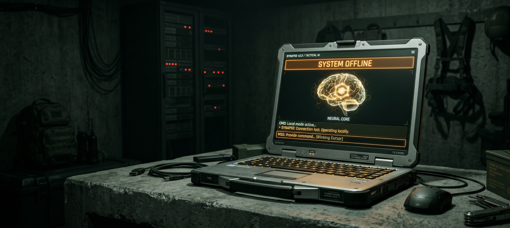

# ☢️ AI-Powered Doomsday Chat (ADA)



## Overview
**ADA (AI-Powered Doomsday Chat)** is a fully offline, tactical survival assistant built for extreme scenarios where internet connectivity is compromised. Powered by local Large Language Models (LLMs) via Ollama and an integrated Retrieval-Augmented Generation (RAG) system, ADA ensures you have access to your critical data, survival procedures, and general AI knowledge—even when the grid goes down.

## 🌟 Key Features
* **100% Offline Operation:** Runs entirely on your local machine using `Ollama`. Zero data is sent to the cloud.
* **Dynamic RAG Integration:** Seamlessly toggle between general AI knowledge and your private `ChromaDB` vector database containing critical procedures and workflows.
* **Short-Term Memory:** Maintains contextual chat history, allowing for fluid, natural conversations and follow-up questions without "amnesia" or echo-looping.
* **On-the-Fly Model Switching:** Switch between loaded models (e.g., `llama3`, `mistral`, `phi3`) directly from the UI.
* **Tactical UI:** Built with `CustomTkinter` featuring a dark mode, global font scaling for low-light visibility, and language-agnostic iconography.
* **Log Export:** Save critical conversation logs to `.txt` files for permanent physical backup.
* **Polyglot Capabilities:** ADA detects the user's language and responds in the exact same language automatically.

## 🛠️ Prerequisites
1. **Python 3.9+** installed on your system.
2. **Ollama** installed and running globally. [Download Ollama here](https://ollama.com/).
3. Pull your preferred models via terminal:
   ```bash
   ollama run llama3
   ollama run mistral
   ollama run phi3